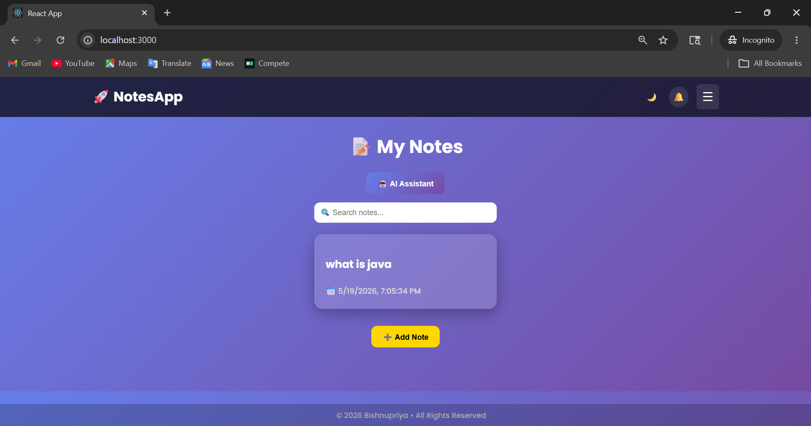
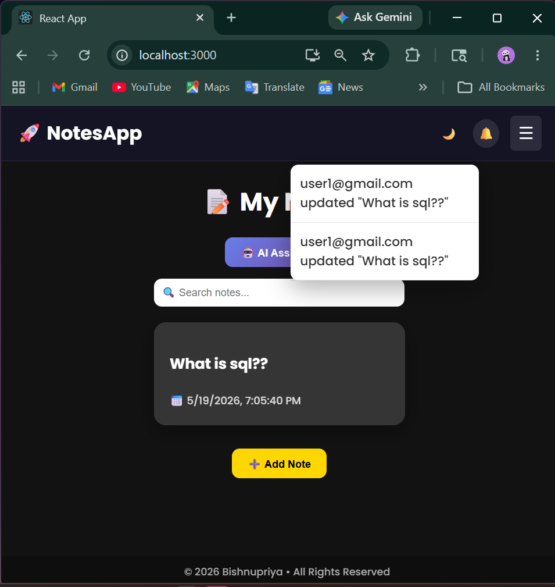
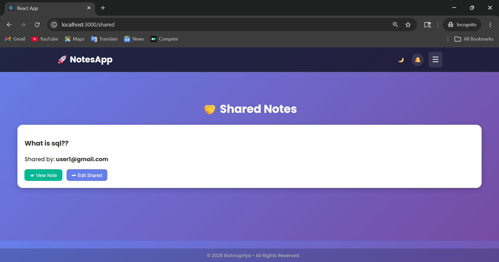
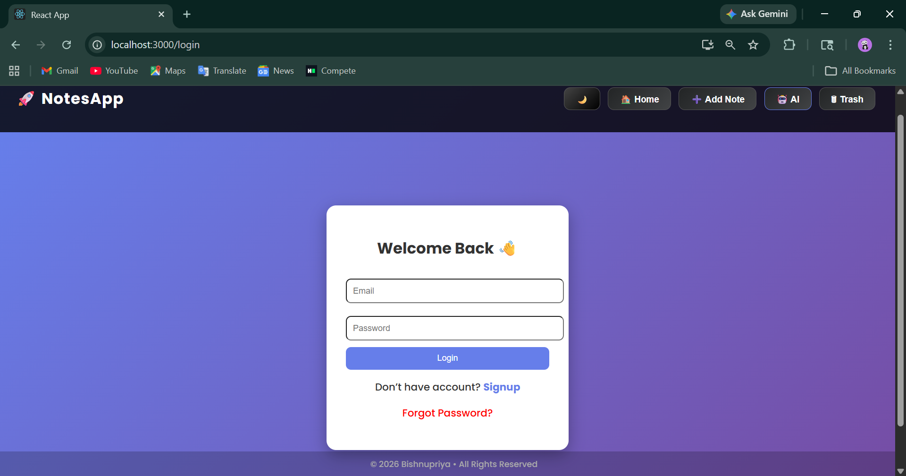
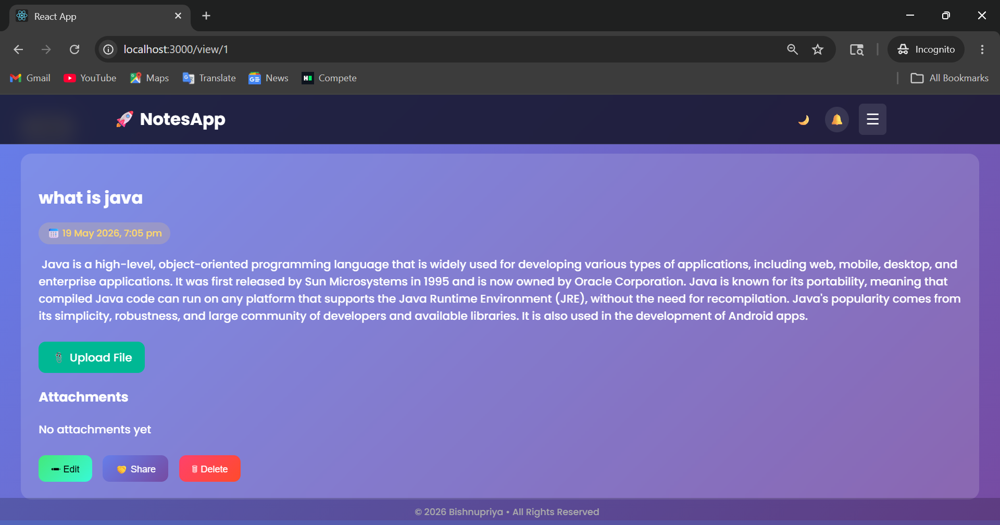
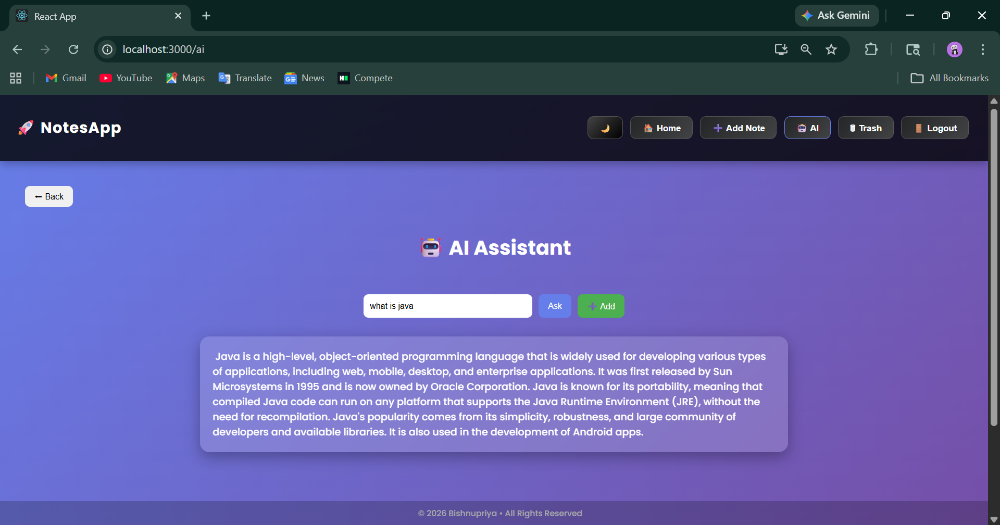
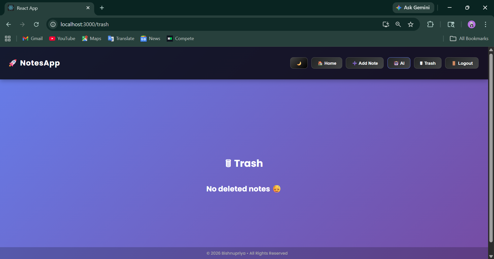
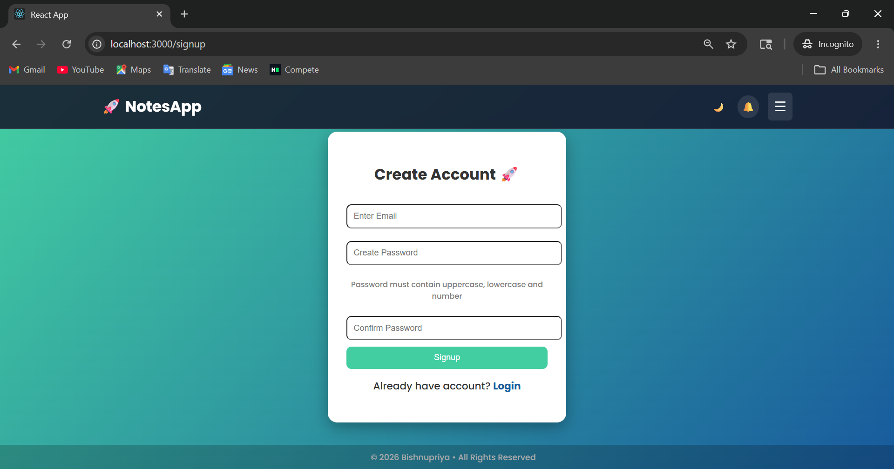
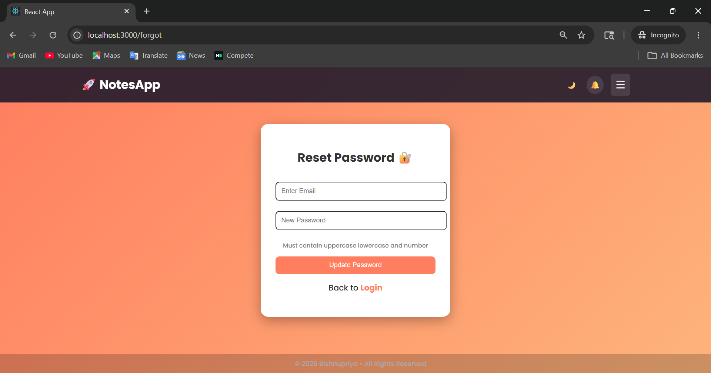

# 🤖 AI-Powered Smart Notes Application

🤖 AI-Powered Smart Notes Application

A modern full-stack smart notes application with AI assistance, secure JWT authentication, real-time collaboration, and instant notifications.
Built using React.js, Spring Boot, MySQL, and WebSocket technologies.

## ✨ Features
- 🔐 JWT-based Authentication & Authorization
- 👤 User Signup & Login System
- 🔑 Secure API Access using Spring Security
- 🔄 Forgot Password Functionality
- 📝 Create, Edit, Delete, and Manage Notes
- 🗑 Trash Management System
- 🔍 Smart Search Functionality
- 🤖 AI Assistant Integration
- 👥 Real-Time Collaboration
- 🔔 Real-Time Notification System
- 📅 Auto Timestamp Management
- ⚡ RESTful APIs
- 💡 Responsive & User-Friendly UI

# 🛠 Tech Stack

## 🔹 Frontend
- React.js
- Axios
- CSS
- JavaScript

## 🔹 Backend
- Spring Boot
- Spring Security
- JWT Authentication
- REST APIs
- Spring Data JPA (Hibernate)
- WebSocket
- WebFlux

## 🔹 Database
- MySQL

## 🔹 Tools & Deployment
- Maven
- Git & GitHub
- Docker
- Railway / Render

---

# 🚀 Advanced Functionalities

## 🔐 JWT Authentication
- Implemented secure token-based authentication and authorization using JWT and Spring Security.
- Protected APIs and user routes from unauthorized access.

## 👥 Real-Time Collaboration
- Enabled multiple users to collaborate and update notes instantly.
- Implemented using WebSocket for real-time communication.

## 🔔 Notification System
- Added instant real-time notifications for note updates and collaboration activities.

## 🤖 AI Assistant
- Integrated AI-powered assistance for smart note management and productivity enhancement.

## 📸 Screenshots

### 🏠 Home Page

### 🔔 Notification

### 🤝 Shared Note 

### 🔐 Login Page

### 📝 Notes Page

### 🤖 AI Assistant

### Trash page

### Signup page

### 🤖 Forgot password

---

## 🔐 Environment Variables

Create a system environment variables
AI_KEY=your_api_key_here
JWT_SECRET=your_secret_key

## ▶️ Run Locally

### 🔹 Backend
cd Backend/notesapi
mvn spring-boot:run

---

### 🔹 Frontend
cd Fullstack-project/notes-frontend
npm install
npm start

---

## 📂 Project Structure
Notes-App/
├── Backend/
│ └── notesapi/
├── Fullstack-project/
│ └── notes-frontend/

---

## 💡 Future Enhancements

☁️ AWS Cloud Deployment
📱 Improved Mobile Responsiveness
📊 Analytics Dashboard
🧠 AI Note Summarization
📎 File/Image Attachments
🌐 Multi-language Support

---

## 👩‍💻 Author

- **Bishnupriya Rout**
GitHub: BishnupriyaRout-Rubi
---

## ⭐ If you like this project

Give it a ⭐ on GitHub!

